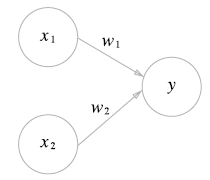

# 2. 퍼셉트론

## 퍼셉트론이란?

> 이번 장의 퍼셉트론은 '인공 뉴런' 혹은 '단순 퍼셉트론'으로 불리는 것

* 그림은 입력으로 2개의 신호를 받은 (단층) 퍼셉트론의 예이다.
* x1, x2 : 입력 신호
* y : 출력 신호
* 원 : **뉴런** 혹은 **노드**
* w1, w2 : **가중치** (전류에서 말하는 **저항**에 해당됨)
* 입력 신호가 뉴런에 보내질 때는 가중치가 곱해지는데 신호의 총합이 정해진 한계를 넘어설 때만 1을 출력한다. 그 한계를 **임계값**이라고 한다.
* 수식 : y = 0(w1x1 + w2x2 <= θ) or 1(w1x1 + w2x2 > θ)

## 단순한 논리 회로

### AND 게이트

|  x1  |  x2  |  y   |
| :--: | :--: | :--: |
|  0   |  0   |  0   |
|  1   |  0   |  0   |
|  0   |  1   |  0   |
|  1   |  1   |  1   |

* 이 AND 게이트를 퍼셉트론으로 표현한다면 w1, w2, θ 값을 정해야 한다.
* 이를 만족하는 매개변수 조합은 무수히 많음.
* 예) (w1, w2, θ) = (0.5, 0.5, 0.7), (0.5, 0.5, 0.8), (1.0, 1.0, 1.0)

### NAND 게이트

* Not AND를 의미하며 AND 게이트 출력을 뒤집은 것

|  x1  |  x2  |  y   |
| :--: | :--: | :--: |
|  0   |  0   |  1   |
|  1   |  0   |  1   |
|  0   |  1   |  1   |
|  1   |  1   |  0   |

* 예) (w1, w2, θ) = (-0.5, -0.5, -0.7)

### OR 게이트

|  x1  |  x2  |  y   |
| :--: | :--: | :--: |
|  0   |  0   |  0   |
|  1   |  0   |  1   |
|  0   |  1   |  1   |
|  1   |  1   |  1   |

* **OR 게이트 매개변수 생각해보기! **

> 퍼셉트론의 매개변수 값을 정하는 것은 컴퓨터가 아닌 **인간**
>
> **학습**이란 적절한 매개변수 값을 정하는 작업이며, 사람은 퍼셉트론 구조를 고민하고 컴퓨터에 학습할 데이터를 주는 일을 한다.

## 퍼셉트론 구현

